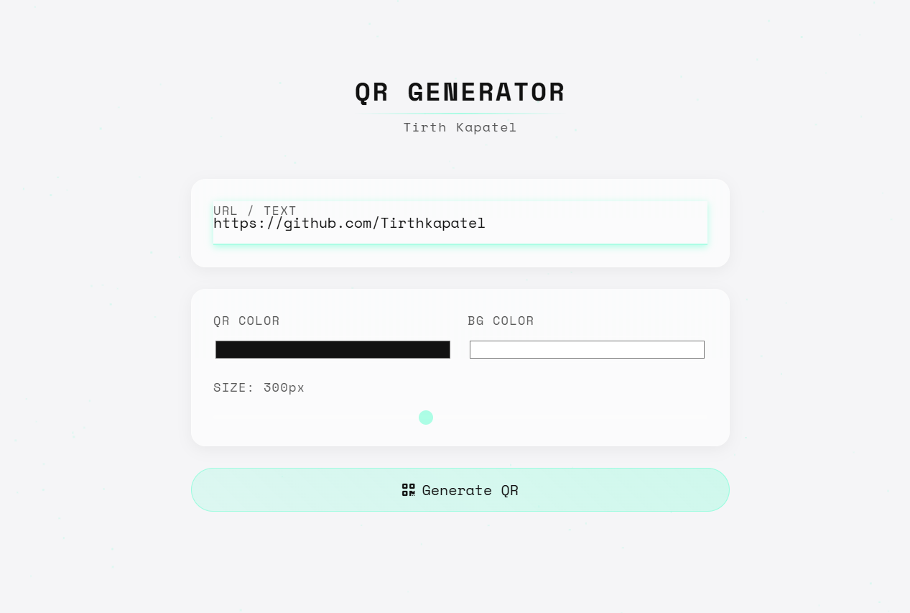
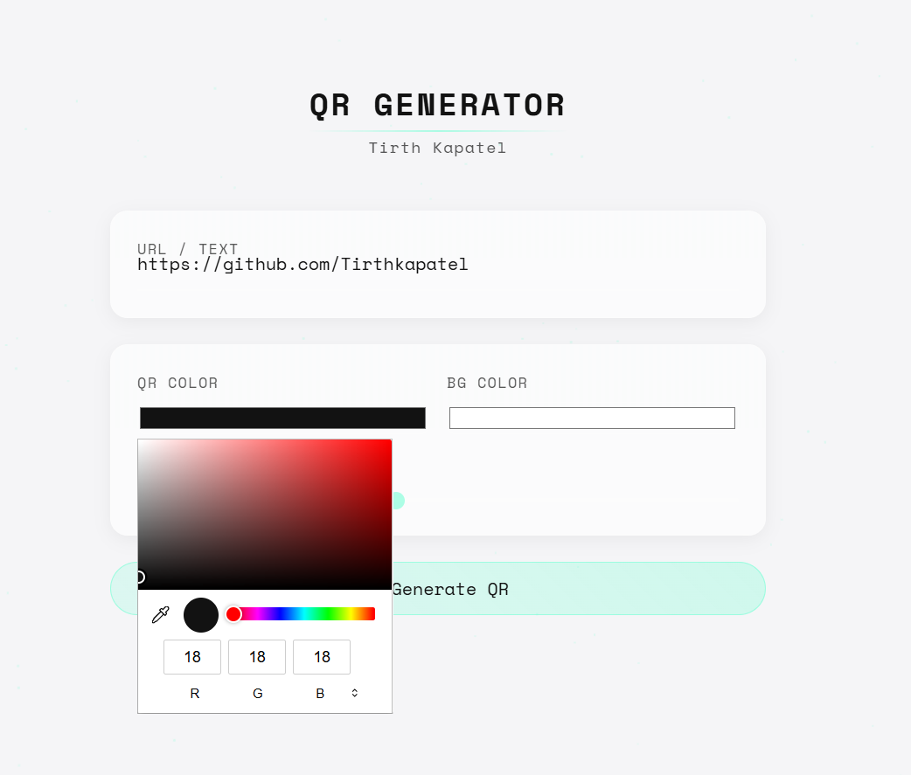
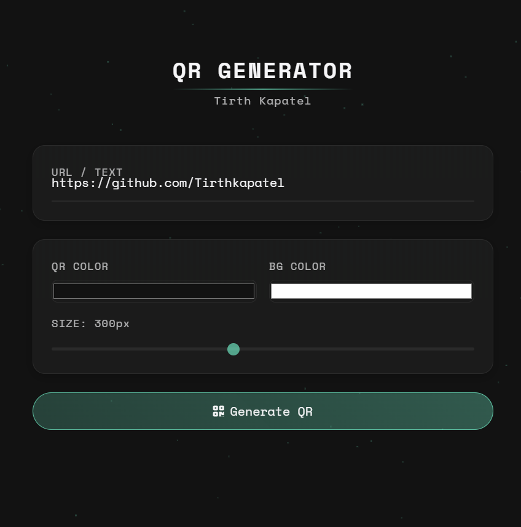

# QR CodeCraze 🚀


A sleek, modern, and highly customizable QR Code Generator built with HTML, CSS, and JavaScript. 

QR CodeCraze features a stunning glassmorphism user interface with smooth animations, dark/light mode toggling, and a responsive design. It allows users to quickly generate, customize, and download QR codes for any URL or text.

## ✨ Features

- **Generate QR Codes Instantly:** Just type or paste your URL/text and hit generate!
- **Beautiful Glassmorphism UI:** A modern design with a floating dot-matrix background animation.
- **Dark/Light Mode:** Seamlessly switch between themes with a satisfying toggle.
- **Customizable:**
  - Change the QR code foreground color.
  - Change the QR code background color.
  - Adjust the size of the QR code using a slider (150px to 500px).
- **Download Capability:** Download your customized QR code as a high-quality `.png` image with a single click.
- **Responsive:** Works perfectly on both desktop and mobile screens.

## 🛠️ Technologies Used

- **HTML5:** Structuring the user interface.
- **CSS3:** Glassmorphism styling, animations, and CSS variables for theming.
- **JavaScript (Vanilla):** Logic for QR code generation, theme toggling, and UI interactions.
- **QR Code Styling Library:** Utilizes `qr-code-styling` for high-quality and customizable QR generation.
- **Font Awesome:** Icons for UI elements.
- **Google Fonts:** Uses 'Space Mono' for a clean, tech-inspired typography.

## 🚀 Getting Started

Since this is a client-side web application, no complex installation or server setup is required.

1. **Clone the repository:**
   ```bash
   git clone https://github.com/your-username/QR_CodeCraze.git
   ```
2. **Navigate to the directory:**
   ```bash
   cd QR_CodeCraze
   ```
3. **Run the app:**
   Simply double-click on `index.html` to open it in your favorite web browser.

## 📸 Screenshots

Here is a glimpse of the application's interface:

### 1. Light Mode UI


### 2. Customizing Colors


### 3. Dark Mode UI



## 🤝 Contributing

Contributions, issues, and feature requests are welcome! Feel free to check the [issues page](https://github.com/your-username/QR_CodeCraze/issues).

## 📄 License

This project is open-source and available under the [MIT License](LICENSE).
